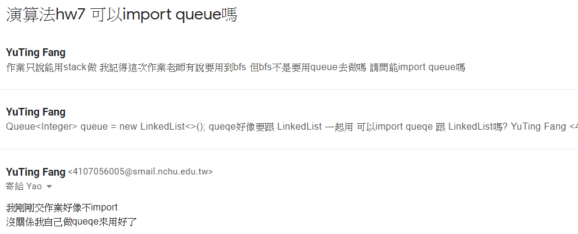
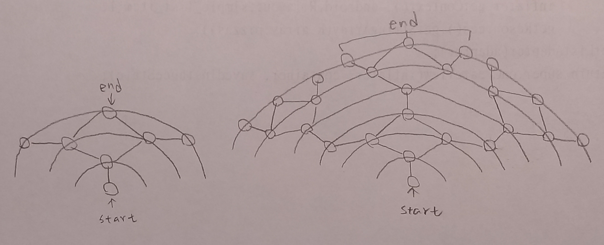

# rank:1
# 題目
找圖的diameter，誤差可在n~n+4
# 解法
兩次BFS:  
第一次隨便找一點做BFS，會走到圖的最邊緣end  
再從end再做一次BFS就可以找到diameter    

# 速度提升
1.耀中提供的packet一個都不能用(後來看[別人的code](https://github.com/tomy0000000/NCHU-Algorithms/blob/master/Homework%207/LSPath4107056042.java)才發現是用來做資料結構，sorry我都沒用的資料結構QQ)，最算能用也很垃圾，自己實作跑比較快  
```java
//直接用linklist插入陣列
for(i=0;i<len;++i) {
  node=new Node(array[i][1]);node.next=adj[array[i][0]];adj[array[i][0]]=node;
  node=new Node(array[i][0]);node.next=adj[array[i][1]];adj[array[i][1]]=node;
}
```
2.Queqe的部分，原本有寫一個class，但每次add都要判斷if(front==null)，浪費效能    
```java
void add(int key) 
{ 
  Node temp = new Node(key); 
  if(front==null) {
    front=temp;
    rear=temp;
  }else {
    this.rear.next = temp; 
    this.rear = temp; 
  }
} 
```
所以我最後就直接寫在wihle迴圈裡
```java
while(front!=null){
  v=front.key; //一開始只取出值(因為如果先刪掉，後面要加入queqe時可能會將指標指向null，導致出錯)
  ...經過一連串處理後...
  front=front.next; //最後才刪掉
}
```
3.node的部分，耀中雖說有百萬筆，但node大概只有12000個，一開始我陣列大小設兩百萬跑很慢，陣列設小一點跑比較快  
所以我預設V=12000，但以防萬一我還是遍歷了所有array找最大值，但即使這樣，還是會比一開始就設成超大陣列還要快
```java
int len=array.length,i=0,V = 12000; //不能設太小，不然會一直更動，降低效能
boolean[] mark;
for(i=0;i<len;++i) {
  if(array[i][1]>V) V=array[i][1];
  if(array[i][0]>V) V=array[i][0];
}
++V;
```
# 後記 

我覺得這次有耀中誤導，所以提高了難度  
比如說可import的packet，我整個  
   
那個Collection到底是幹甚麼用的?還有BFS不是要用Queqe做嗎?import Stack幹嘛，還特地去問助教  
   
我後來想說這可能是考題的一部份，所以就自己實作了  

至於Collection和Stack想了很久看能不能用在我的code裡面，結果發現更本用不到  
而ArrayList可用來做[adjacency list](https://www.programiz.com/dsa/graph-adjacency-list)  
  
但根本垃圾，使用前還需要每個new一次，浪費效能，所以我最後就自己實作了

還有耀中說需要每個點都做BFS，我就覺得疑惑為什麼一定要每個點都做，不是只要[兩次BFS](https://stackoverflow.com/questions/21431379/approximation-algorithem-for-finding-diameter-of-a-graph)就行了嗎?害我一開始對自己的做法感到懷疑，想說有什麼case是我忽略的，我google了兩天，一直都找不到我想要的答案，精確一點的就Dijkstra's algorithm，近似演算法只找到針對千萬或上億個node級別的論文(記憶體切片，平行處理，圖node的壓縮)  

直到我發現了一篇文章，知道了我的作法的[例外case](https://cs.stackexchange.com/questions/194/the-time-complexity-of-finding-the-diameter-of-a-graph)長什麼樣，幸好老師很nice還給誤差範圍，我估了一下誤差大概是多少，應該有在誤差範圍內   
   

在左邊那個case裡，如果不幸選到start當起點，且剛好end為終點，就會發生算出來是3，答案實際上是4的情況，如果像右圖一樣再擴一層，誤差會變成2  
也就是說，誤差為4要擴四層，但我想助教也沒那麼閒出測資搞我們，就算有這樣的測資，要剛好start和end要是那幾個點，機率小到可以買樂透，所以我最後使用了這個方法


